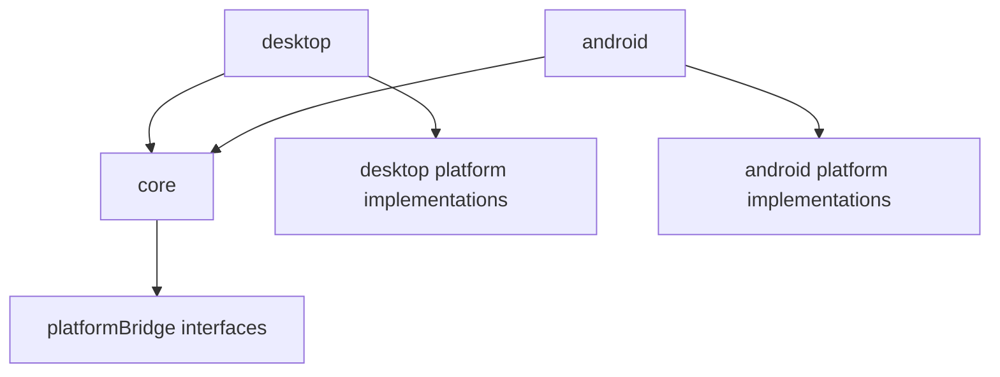

# ENGINE_INTERNALS_MAP_FOR_CODEX (Engine-Source Focused)

Open this file only when you are working on Seal Engine 3-M itself (engine bugs, engine features, platform adapter changes, performance work).

If you are working on an application that depends on the engine as a compiled JAR/AAR, start with `PROJECT_MAP_FOR_CODEX.md` instead and treat engine source reading as optional.

## 1. Repository Overview (Engine Source)

- This repository is the Seal Engine 3-M engine codebase (Gradle multi-module).
- Modules:
  - `core/`: platform-agnostic runtime and most public APIs
  - `desktop/`: desktop (LWJGL/Skija/BasicPlayer) platform adapter + launcher
  - `android/`: Android GLES platform adapter + launcher (Android library module)
- `README.md` is the public, user-oriented documentation and API manual.

## 2. Recommended Reading Order (Engine Work)

1. `README.md`
2. `core/src/main/java/com/nikitos/Engine.java`
3. `core/src/main/java/com/nikitos/CoreRenderer.java`
4. `core/src/main/java/com/nikitos/GamePageClass.java`
5. `core/src/main/java/com/nikitos/platformBridge/PlatformBridge.java` and related bridge interfaces
6. Platform bootstrap/launcher:
   - `desktop/src/main/java/com/nikitos/platform/DesktopLauncher.java`
   - `android/src/main/java/com/seal/gl_engine/platform/AndroidLauncher.java`
7. Then dive by subsystem (camera, shaders, vertices, touch, VRAM lifecycle).

## 3. Key Engine Concepts (Source-Level)

### 3.1 Page-based lifecycle and ownership

- The dominant app model is page-based: application code defines `GamePageClass` implementations.
- Many engine objects accept a `GamePageClass creator` (or similar) and treat it as an ownership key.
- Page changes (`Engine.startNewPage(...)`) trigger cleanup/reset in page-scoped registries (VRAM objects, shaders, touch processors).

This page-scoping behavior is one of the most important architectural constraints; changing it can easily cause leaks or cross-page corruption.

### 3.2 Platform bridge pattern

- `core` stays platform-agnostic by depending on platform bridge interfaces.
- `desktop` and `android` provide concrete implementations for GL calls/constants, images/fonts, asset loading, runtime filesystem, mouse/window control, audio, and error/logging.

Key packages:

- `core/src/main/java/com/nikitos/platformBridge/*` (interfaces/contracts)
- `desktop/src/main/java/com/nikitos/platform/*` (desktop implementations)
- `android/src/main/java/com/seal/gl_engine/*` (Android implementations; note different package root)

### 3.3 Render loop driver

- `CoreRenderer` is the platform-independent render-loop driver.
- Changes here affect every platform and every frame.
- `Engine.startNewPage(...)` makes the exact incoming instance current, invokes
  its default-no-op `GamePageClass.onInstalled()`, then invokes its initial
  `onSurfaceChanged(...)` before outgoing registries are cleaned.
- Non-positive surface callbacks are transient lifecycle signals, not usable
  render sizes. `Utils` retains the last positive viewport and `Engine` does
  not forward the invalid callback to the current page.

### 3.4 GPU resource lifecycle (VRAM)

- `VRAMobject` is the base for GPU-backed resources tracked globally.
- The system supports deletion and reload (e.g., on page changes or GL context recreation).
- `FrameBuffer.resize(...)` retains its dimension-independent child
  `VertexBuffer` while reallocating only framebuffer attachments. Page deletion
  deletes that child idempotently; context reload regenerates the existing
  `VertexBuffer` wrapper instead of registering a replacement.

This is a high-risk area: memory leaks, stale GL handles, and “works on desktop but not Android” bugs often originate here.

## 4. Source Navigation (Where Things Live)

### 4.1 Public / application-facing APIs (start here)

- `core/src/main/java/com/nikitos/Engine.java`
- `core/src/main/java/com/nikitos/GamePageClass.java`
- `core/src/main/java/com/nikitos/platformBridge/LauncherParams.java`
- `core/src/main/java/com/nikitos/platformBridge/AudioPlayer.java` (music + one-shot SFX; `resume()` continues after pause; no 3D audio API)
- `core/src/main/java/com/nikitos/platformBridge/RuntimeFileBridge.java` (shared runtime path semantics; relative-path root supplied by platform)
- `core/src/main/java/com/nikitos/platformBridge/MouseControlBridge.java` (desktop window mouse control API; safe no-op on Android)
- `core/src/main/java/com/nikitos/main/camera/*` (camera/projection)
- `core/src/main/java/com/nikitos/main/images/*` (`PImage`, `PFont`, image/font bridges)
- `core/src/main/java/com/nikitos/main/vertices/*` (`Shape`, `Polygon`, `SimplePolygon`, `SkyBox`, etc.)
- `core/src/main/java/com/nikitos/main/frameBuffers/*` (`FrameBuffer`)
- `core/src/main/java/com/nikitos/main/touch/*` (`TouchProcessor`)
- `core/src/main/java/com/nikitos/main/keyboard/*` (`KeyListener`, `KeyReleasedListener`, `KeyComboListener`, `KeyboardProcessor`)
- `core/src/main/java/com/nikitos/maths/*` (`PVector`, `Vec3`, `Matrix`, `Section`)

### 4.2 Engine internals / lower-level subsystems

- `core/src/main/java/com/nikitos/CoreRenderer.java`
- `core/src/main/java/com/nikitos/main/VRAMobject.java`
- `core/src/main/java/com/nikitos/main/shaders/*` (program creation, adaptor binding, shader data forwarding)
- `core/src/main/java/com/nikitos/main/vertex_bueffer/*` (vertex buffer/VAO wrappers; note the package typo)
- `core/src/main/java/com/nikitos/utils/*` (global screen/time helpers; cross-cutting)
- `core/src/main/java/com/nikitos/main/debugger/*` (debug overlay and debug values)

### 4.3 Platform entry points

- Desktop:
  - `desktop/src/main/java/com/nikitos/platform/DesktopLauncher.java`
  - `desktop/src/main/java/com/nikitos/platform/DesktopOpenGlContextHints.java`
  - `desktop/src/main/java/com/nikitos/platform/DesktopBridge.java`
  - `desktop/src/main/java/com/nikitos/platform/DesktopRuntimeFileBridge.java`
  - `desktop/src/main/java/com/nikitos/platform/DesktopMouseControlBridge.java`
  - desktop GL/touch/audio/adapters under `desktop/src/main/java/...`
  - audio implementation: `desktop/src/main/java/com/nikitos/platform/AudioPlayerDesktop.java`
  - desktop audio smoke test main: `desktop/src/test/java/AudioSmokeTestMain.java` (plain `main()`, default package)
- Android:
  - `android/src/main/java/com/seal/gl_engine/platform/AndroidLauncher.java`
  - `android/src/main/java/com/seal/gl_engine/platform/AndroidBridge.java`
  - `android/src/main/java/com/seal/gl_engine/platform/AndroidRuntimeFileBridge.java`
  - `android/src/main/java/com/seal/gl_engine/platform/AndroidMouseControlBridge.java`
  - `android/src/main/java/com/seal/gl_engine/platform/AndroidFrameCaptureSource.java`
  - `android/src/main/java/com/seal/gl_engine/OpenGLRenderer.java` (GLSurfaceView renderer adapter)
  - `android/src/main/java/com/seal/gl_engine/touch/AndroidMotionEventAdapter.java`
  - audio implementation: `android/src/main/java/com/seal/gl_engine/mp3/AndroidAudioPLayer.java`
    - music: `MediaPlayer`
    - SFX: `SoundPool` (async load; play is triggered on `OnLoadComplete`), MP3 SFX fallback to short-lived `MediaPlayer`

## 5. Subsystem Notes (What To Expect Internally)

### 5.1 Camera and matrix model

- `Camera` contains `CameraSettings` and `ProjectionMatrixSettings`.
- `Matrix` is a static wrapper over platform-specific matrix operations and is initialized by `Engine`.

### 5.2 Shader system

- `Shader` loads shader sources and creates GL programs.
- `Adaptor` implements attribute/uniform binding strategy.
- `ShaderData` is a uniform-data forwarding mechanism often used by lighting/material classes.

Implication: custom shader work usually requires a matching adaptor and careful uniform location handling.

### 5.3 Lighting/material

- Lighting/material classes (ambient/directional/point/source light, material, exposure) are primarily shader-uniform carriers.
- They are typically page-scoped through the shader data forwarding mechanism.

### 5.3.1 Desktop OpenGL context hints

- `LauncherParams.setDesktopOpenGl33CoreContext(true)` is an explicit,
  desktop-only request for OpenGL 3.3 core profile. Its default is `false`.
- `DesktopOpenGlContextHints` owns the GLFW-specific mapping so `core` retains
  no GLFW dependency.
- `DesktopLauncher` applies the mapping after the existing
  visibility/resizability/MSAA hints and before the macOS forward-compatible
  hint and window creation. The default path emits no extra context hints.
- This option does not alter `CoreRenderer`, timing, FPS, the frame loop, or
  Android behavior.

### 5.4 Input/touch threading model

- `TouchProcessor` buffers callbacks and processes them later (render-thread oriented).
- This design avoids GL-thread/context issues but means “touch happens later” is normal.
- `AndroidMotionEventAdapter` is a detached immutable snapshot of action metadata,
  every pointer ID, and every pointer coordinate. Create it before
  `GLSurfaceView.queueEvent(...)`; queued engine input never retains the live
  recyclable `MotionEvent`.

### 5.4.1 Android observer frame capture

- `AndroidBridge` exposes one stable `AndroidFrameCaptureSource` when the engine
  observer path requests it. The no-observer frame path still does not request a
  source.
- `OpenGLRenderer` only updates source lifecycle state from
  `onSurfaceCreated(...)` and `onSurfaceChanged(...)`; it performs no per-frame
  capture work.
- An observer's explicit `capture()` call runs synchronously on the registered
  `GLSurfaceView` GL thread after the existing frame body and before swap. It
  validates the current EGL context and surface dimensions, reads the default
  framebuffer from `GL_BACK` with a tightly packed client target. It temporarily
  unbinds any pixel-pack buffer, clears row/skip pack parameters, and restores
  read framebuffer/buffer plus every affected pack state with independent
  best-effort operations. A read failure remains primary and restore failures
  are suppressed. GLES bottom-left rows are then flipped into the core top-left
  straight-alpha RGBA contract.

### 5.4.2 Android process session and Activity lifecycle

- A synchronized process-wide session owns one `Engine`, `AndroidBridge`, and
  lazy `AndroidFrameCaptureSource`. Engine settings are copied into an
  application-context snapshot; the session does not retain an Activity or the
  caller's mutable `AndroidLauncherParams`.
- Each Activity creates only its own `GLSurfaceView`. Replacement is a
  synchronized transaction: the exact previous view is quiesced before
  construction reaches `setRenderer(...)`, then the new view becomes current.
  A null/failed construction restores the previous running state, while a
  process-paused view remains paused. This prevents overlapping GL threads
  from using the shared Engine/static VRAM state. A no-argument
  `AndroidBridge` lazily binds the first view's application context, never its
  Activity context. Its deprecated protected `startPage` field is retained for
  source/binary compatibility and mirrors the process settings supplier.
- `AndroidLauncher.onPause(view)`, `onResume(view)`, and `detach(view)` are
  identity-aware and idempotent. Stale callbacks cannot operate on a newer
  Activity's view, and duplicate callbacks do not invoke Engine lifecycle or
  time accounting twice. The exact current view is quiesced before page/Utils
  pause; the later bridge callback from `Engine.onPause()` is an idempotent
  fallback. Direct Engine lifecycle calls remain compatible.
- `OpenGLRenderer` construction performs no GL work and creates no
  `CoreRenderer`. A positive `onSurfaceChanged(...)` callback creates or
  replaces the local `CoreRenderer` on the current GL thread. Draw callbacks
  before that initialization return without clearing or drawing.
- Default `GLSurfaceView` context-preservation behavior is unchanged. Surface
  recreation still creates a new local `CoreRenderer`, while frame IDs remain
  owned locally by that renderer.

### 5.5 Keyboard input model

- `KeyboardProcessor` buffers key callbacks and executes them later from the render thread via `KeyboardProcessor.processKeys()` (called from `CoreRenderer.draw()`).
- Page scoping is handled similarly to touch: `Engine.startNewPage(...)` triggers `KeyboardProcessor.onPageChange()` to drop listeners created by the previous page (unless created with `creatorPage == null`).
- `KeyComboListener` calls its callback once when all keys from the combo are pressed together (order-independent), and becomes ready again after any combo key is released.
- Platform forwarding:
  - Desktop: `desktop/src/main/java/com/nikitos/platform/DesktopLauncher.java` forwards GLFW key press/release.
  - Android: `android/src/main/java/com/seal/gl_engine/platform/AndroidBridge.java` forwards key events from the `GLSurfaceView` (focus required).

### 5.6 Runtime filesystem and mouse control

- Public API entry point is `Engine`; game code should not branch on platform for standard runtime file operations.
- `RuntimeFileBridge` centralizes path semantics for all runtime file methods:
  - absolute paths use `File.isAbsolute()`
  - relative paths resolve against a platform-defined runtime root, are normalized, and may not escape that root
  - `loadTextFile(...)` / `saveTextFile(...)` use UTF-8
  - `fileExists(...)` only reports regular files
  - `folderExists(...)` only reports directories
  - `createFolder(...)` uses recursive directory creation
  - `saveTextFile(...)` does not auto-create parent directories
- Platform roots:
  - Desktop: `System.getProperty("user.dir")`
  - Android: `Context.getFilesDir()` app-internal persistent files directory
- Asset loading is still handled separately through `SealAssetManager`; runtime file APIs must not be used as a replacement for packaged resources.
- Mouse control is routed through `MouseControlBridge`:
  - Desktop implementation is bound to the actual GLFW window from `DesktopLauncher`
  - Android implementation is intentionally a safe no-op to keep the API surface stable without affecting touch/input behavior

### 5.7 TouchProcessor desktop mouse extension

- `TouchProcessor` still owns buffered touch delivery and page cleanup on page changes.
- Desktop mouse callbacks are implemented as a separate path inside `TouchProcessor`, not by mutating touch capture state:
  - one page-scoped map for left button callbacks
  - one page-scoped map for right button callbacks
  - one page-scoped map for mouse moved callbacks
  - one page-scoped map for mouse wheel callbacks
- Re-registering the same handler type for the same page overwrites the previous callback.
- Callback payloads are separate from touch payloads:
  - `MousePoint` for button/move events
  - `MouseWheelData` for wheel events
- Mouse delivery is state-based:
  - raw desktop callbacks only overwrite the latest mouse coordinates, button flags, and accumulated wheel delta
  - mouse events are not queued
  - user mouse callbacks are dispatched at most once per frame from `TouchProcessor.processMotions()`
  - reusable `MousePoint` / `MouseWheelData` instances are overwritten instead of allocating per raw event
- Desktop forwarding lives in `DesktopLauncher`:
  - left button press updates mouse state for both the new mouse path and the existing touch-start path
  - left button move still feeds the existing touch move path while also overwriting latest mouse position state
  - right button and wheel events only update the new mouse callback state path
- Android does not forward any of these mouse callbacks at runtime.
- Repo-level verification scene: `desktop/src/test/java/MouseCallbacksSmokeTestMain.java` starts a dedicated page with two visible polygons to validate latest-state mouse-move and once-per-frame wheel delivery without touching gameplay code.

## 6. Dependency and Interaction Maps

### 6.1 Module-level dependency direction



### 6.2 Runtime interaction (high level)

```text
DesktopLauncher / AndroidLauncher
  -> Engine
  -> CoreRenderer
  -> current GamePageClass
     -> Camera / PImage / Shape / Polygon / TouchProcessor / Shader / Light / FrameBuffer
  -> post-frame systems
     -> VerticesShapesManager
     -> Debugger
     -> TouchProcessor queue
```

## 7. Risky Hotspots (Be Careful)

High blast-radius code (changes can affect all games/apps and both platforms):

- `core/src/main/java/com/nikitos/CoreRenderer.java`
- `core/src/main/java/com/nikitos/Engine.java`
- `core/src/main/java/com/nikitos/platformBridge/*`
- `core/src/main/java/com/nikitos/main/VRAMobject.java`
- `core/src/main/java/com/nikitos/main/shaders/*` (especially binding/adaptors and global registries)
- `core/src/main/java/com/nikitos/main/touch/TouchProcessor.java`
- `core/src/main/java/com/nikitos/utils/Utils.java`

## 8. Conventions and Gotchas

- `core` must remain platform-agnostic; platform code goes behind bridge interfaces.
- Registries/global managers are used in multiple subsystems (`VRAMobject`, `Shader`, `TouchProcessor`, `VerticesShapesManager`, `Animator`, `Debugger`).
- Some naming is inconsistent and should be treated as legacy:
  - `vertex_bueffer` typo in package name
  - `AudioPLayerDesktop` capitalization inconsistency
  - Android package root is `com/seal/gl_engine/*`, not `com/nikitos/*`
  - Android SFX: `SoundPool.load()` is asynchronous; avoid "load then immediately play" patterns.
  - Android packaging: if you use `AssetManager.openFd(...)`, the asset must not be compressed (see `android/build.gradle` `aaptOptions.noCompress`).

## 9. Items That Often Need Verification

- Asset loading behavior differences between Android and desktop packaging.
- GL context recreation behavior (especially on Android) and correctness of resource reload paths.
- Audio APIs and platform-specific implementations (some methods may be stubs/partial).
