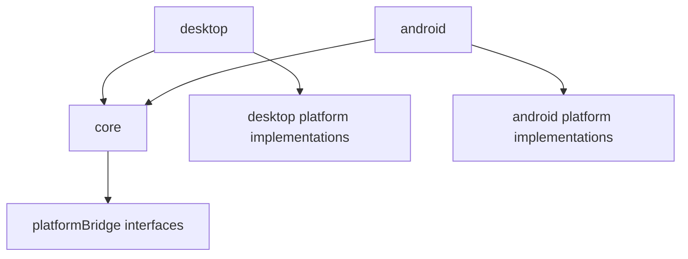

# PROJECT_MAP_FOR_CODEX

## 1. Project Overview

- `Seal Engine 3-M` is a cross-platform Java game engine for 2D and 3D OpenGL-based applications.
- The repository is a Gradle multi-module engine codebase, not a complete sample game/app.
- `README.md` is the primary high-level source of truth. It describes the engine around:
  - `Engine`
  - `GamePageClass`
  - `LauncherParams`
  - camera/projection
  - shaders
  - vertex objects
  - animation
- The dominant application model is page-based:
  - application code defines one or more `GamePageClass` implementations
  - `Engine` switches between pages via `startNewPage(...)`
  - most GPU/touch/shader state is scoped to the owning page class
- High-level architecture:
  - `core`: engine runtime, rendering abstractions, math, scene/render primitives, touch, debug tools
  - `desktop`: LWJGL/Skija/basicplayer desktop platform adapter and launcher
  - `android`: Android GLES platform adapter and launcher
- Key design patterns visible in code:
  - platform bridge / facade layer via `com/nikitos/platformBridge/*`
  - page-scoped lifecycle and cleanup
  - deferred touch command queue processed on the render thread
  - GPU resource registry with reload on GL context recreation
  - shader adaptor pattern for attribute/uniform binding
- Important terminology used in the repo:
  - `page`: a game/application screen implementing `GamePageClass`
  - `core renderer`: platform-independent render loop (`CoreRenderer`)
  - `VRAMobject`: GPU-backed object tracked for delete/reload
  - `VerticesSet`: renderable shape/polygon family managed by `VerticesShapesManager`
  - `Adaptor`: shader binding strategy

## 2. Repository Structure

### Top level

- `README.md`
  - Primary architecture and API manual.
- `build.gradle`, `settings.gradle`, `gradlew*`
  - Gradle multi-module build.
- `core/`
  - Foundational engine module. Main application-facing API lives here.
- `desktop/`
  - Desktop runtime adapter. Depends on `core`.
- `android/`
  - Android runtime adapter. Depends on `core`.
- `build/`
  - Build output.
- `.idea/`, `.gradle/`
  - IDE/build metadata.

### Gradle modules

- `core`
  - Plain Java library.
  - Depends on local `libs/obj-0.4.0.jar` for OBJ loading.
- `desktop`
  - Java module.
  - Depends on `core`, LWJGL, Skija, and BasicPlayer/JLayer/MP3SPI.
- `android`
  - Android library module, not an Android application module.
  - Depends on `core`.

### Engine internals vs application-facing areas

- Application-facing first:
  - `core/src/main/java/com/nikitos/Engine.java`
  - `core/src/main/java/com/nikitos/GamePageClass.java`
  - `core/src/main/java/com/nikitos/platformBridge/LauncherParams.java`
  - `core/src/main/java/com/nikitos/main/camera/*`
  - `core/src/main/java/com/nikitos/main/images/*`
  - `core/src/main/java/com/nikitos/main/vertices/*`
  - `core/src/main/java/com/nikitos/main/light/*`
  - `core/src/main/java/com/nikitos/main/touch/*`
  - `core/src/main/java/com/nikitos/maths/*`
- Engine internals / lower-level:
  - `core/src/main/java/com/nikitos/CoreRenderer.java`
  - `core/src/main/java/com/nikitos/main/VRAMobject.java`
  - `core/src/main/java/com/nikitos/platformBridge/*`
  - `core/src/main/java/com/nikitos/main/shaders/*`
  - `core/src/main/java/com/nikitos/main/vertex_bueffer/*`
  - `core/src/main/java/com/nikitos/utils/*`
- Optional/debugging/tooling:
  - `core/src/main/java/com/nikitos/main/debugger/*`
  - `core/src/main/java/com/nikitos/copy_java.py`
  - `core/src/main/java/com/nikitos/docs.md`

### Notable omissions

- No first-party example app/game is included in this repository.
- `README.md` points to external example apps:
  - desktop: `Demo-launcher`
  - android: `Demo-app`
- `desktop/src/main/resources` and `android/src/main/res` are effectively empty here.
- This means application assets are expected to live in the consuming app, not in the engine repo.
- Use the current app you are working at as an example

## 3. Deep Dive Into `core`

### Purpose of `core`

- `core` is the shared engine runtime.
- It owns:
  - lifecycle and page switching
  - render loop orchestration
  - platform abstraction interfaces
  - math/camera/projection
  - renderable primitives and mesh loading
  - textures/framebuffers
  - shader program handling
  - touch/input dispatch model
  - animation helpers
  - debugging overlay

### Main packages in `core`

- `com/nikitos/`
  - `Engine`, `CoreRenderer`, `GamePageClass`
- `com/nikitos/platformBridge/`
  - platform abstraction contracts
- `com/nikitos/maths/`
  - vectors, sections, matrix wrapper
- `com/nikitos/main/camera/`
  - camera + projection settings/application
- `com/nikitos/main/images/`
  - `PImage`, `PFont`, abstract image/font bridge
- `com/nikitos/main/vertices/`
  - mesh/polygon/skybox primitives and redraw manager
- `com/nikitos/main/vertex_bueffer/`
  - GPU vertex buffer/VAO wrapper
- `com/nikitos/main/textures/`
  - texture wrappers
- `com/nikitos/main/frameBuffers/`
  - off-screen render targets
- `com/nikitos/main/shaders/`
  - shader creation, shader data forwarding, adaptors
- `com/nikitos/main/light/`
  - shader-bound lighting/material data
- `com/nikitos/main/touch/`
  - touch processor abstraction and event buffering
- `com/nikitos/main/engine_object/`
  - `SealObject`, transform + animation wrapper over `Shape`
- `com/nikitos/main/animator/`
  - animation queue and transmission/velocity helpers
- `com/nikitos/main/debugger/`
  - runtime debug UI and values
- `com/nikitos/utils/`
  - dimensions/time/math helpers, asset image loading

### Core lifecycle and flow

#### Startup / initialization

- Platform module creates `Engine(platformBridge, launcherParams)`.
- `Engine`:
  - stores platform bridge
  - initializes `Matrix` with the platform matrix bridge
  - records program start time
- Platform module creates `CoreRenderer(width, height, engine)`.
- `CoreRenderer`:
  - computes screen dimensions and scale coefficients via `Utils.setDim(...)`
  - calls `graphicsSetup()`
  - forwards size change to `engine.onSurfaceChanged(...)`
- On first actual frame, `CoreRenderer.draw()` calls `engine.startDefaultPage()` if no page exists yet.

#### Per-frame flow

`Platform Launcher/Renderer -> CoreRenderer.draw() -> Engine/GamePage -> post-frame systems`

Detailed order in `CoreRenderer.draw()`:

1. `engine.calculateFps()`
2. lazy creation of default page if missing
3. `VerticesShapesManager.onFrameBegin()`
4. current page `draw()`
5. `Debugger.draw()`
6. `VerticesShapesManager.redrawAll()`
7. `TouchProcessor.processMotions()`

#### Page switching

- `Engine.startNewPage(...)` does all of the following:
  - clears page timer
  - swaps current page
  - calls `newPage.onSurfaceChanged(currentWidth, currentHeight)`
  - triggers cleanup/reset for page-scoped systems:
    - `VRAMobject.onPageChange()`
    - `Shader.onPageChange()`
    - `TouchProcessor.onPageChange()`
- This page-scoping behavior is one of the most important architectural constraints in the engine.

### Central abstractions in `core`

#### `Engine`

- Main lifecycle owner.
- Public API expected to be used by application code:
  - `startNewPage(...)`
  - `pageMillis()`
  - `glClear()`
  - `enableBlend()`, `disableBlend()`
  - `getPlatform()`
  - `fps`
- `Engine.getVersion()` currently returns `v3.2.1`.

#### `GamePageClass`

- Main application extension point.
- All game/app screens inherit from it.
- Required methods:
  - `onSurfaceChanged(int x, int y)`
  - `draw()`
  - `onResume()`
  - `onPause()`
- The README guidance and actual code both imply:
  - heavy assets should be created up front or in page construction
  - resolution-dependent objects should be recreated in `onSurfaceChanged`
  - rendering should happen in `draw()`

#### `CoreRenderer`

- Platform-independent render loop driver.
- Central but mostly internal.
- If changed, it affects every platform and every frame.

#### `PlatformBridge`

- The main inversion point between `core` and platform modules.
- `core` depends on bridge interfaces only.
- `desktop` and `android` provide concrete implementations for:
  - matrix ops
  - shader operations
  - vertex buffers/VAOs
  - GL constants and GL commands
  - image/font implementations
  - asset loading
  - audio
  - error printing/logging

#### `VRAMobject`

- Base class for GPU-backed resources.
- Tracks all instances globally.
- Reloaded on context redraw and deleted on page change if owned by another page.
- Used by:
  - `Texture`
  - `VertexBuffer`
  - `FrameBuffer`
  - related subclasses

This is the main page-scoped GPU resource management mechanism.

### Rendering, scene/model, and object concepts

#### There is no full scene graph or ECS visible

- No ECS or formal world/scene package is present.
- The engine appears object/render-call oriented rather than ECS-driven.
- Application pages likely orchestrate objects directly.

#### Mesh/render primitives

- `Shape`
  - OBJ mesh loader/renderable.
  - Can load mesh asynchronously from assets.
  - Supports diffuse texture and optional normal map.
- `Polygon`
  - Textured quad-like primitive backed by two triangles.
  - Common for UI panels, sprites, overlays, and 2D-on-3D surfaces.
- `SimplePolygon`
  - convenience subclass around `Polygon`.
- `SectionPolygon`
  - line/section-related polygon helper.
- `SkyBox`
  - cube map-backed skybox primitive.
- `VerticesShapesManager`
  - tracks `VerticesSet` instances
  - handles redraw scheduling and per-frame readiness checks

#### Transform/object wrapper

- `SealObject`
  - wraps a `Shape`
  - owns position/rotation/scale state
  - integrates with `Animator`
  - applies transform matrix before drawing shape

This is the closest thing to an engine-level “entity/model” abstraction visible in the repo.

### Camera and matrix model

- `Camera`
  - public container over `CameraSettings` and `ProjectionMatrixSettings`
  - supports `resetFor3d()` and `resetFor2d()`
  - applies view + projection via platform matrix bridge
- `Matrix`
  - static wrapper over platform-specific matrix operations
  - initialized once by `Engine`
- Typical usage pattern:
  - create/recreate `Camera` in `onSurfaceChanged`
  - choose 2D or 3D mode
  - call `camera.apply()` before drawing
  - you may extend Camera class and create custom CameraSettings and ProjectionMatrixSettings classes with custom reset functions (resetFor2D and resetFor3D) if you need this.

### Shader system

- `Shader`
  - loads shader source from assets/resources
  - creates GL program
  - keeps a global shader list
  - tracks active shader
  - prunes page-owned shaders on page change
- `Adaptor`
  - strategy object for binding vertex data and shader locations
  - also owns forwarding of `ShaderData`
- `ShaderData`
  - page-aware uniform data object registered into adaptor-global forwarding
  - used by lighting/material classes
- Default adaptor package:
  - `main/shaders/default_adaptors/*`

Implication for future work:

- custom shader work is expected to include a matching `Adaptor`
- lighting/material data is pushed via `ShaderData` subclasses when shaders are applied

### Lighting/material system

- `AmbientLight`, `DirectedLight`, `PointLight`, `SourceLight`, `Material`, `ExpouseSettings`
- These are shader-uniform data carriers, not a complete scene-light manager.
- They are page-scoped through `ShaderData`.
- `Material` requires explicit `apply()` after locations are known.

### Input/touch system

- `TouchProcessor` is the key app-facing interaction class.
- Design:
  - touch events come from platform adapters
  - capture is based on a hitbox callback
  - callbacks are buffered into a command queue
  - queue is processed on the render thread after draw
- Important behavior:
  - processors are prioritized
  - processors are page-scoped and removed on page change
  - callbacks are intentionally deferred to avoid GL-context/thread issues

This is a critical extension point for UI/gameplay interaction.

### Resource and asset model

- Asset access is abstracted through `SealAssetManager`.
- `FileUtils.loadImage(...)` uses the current platform image bridge.
- `PImage` and `PFont` are cross-platform wrappers.
- `Texture`, `CubeMap`, `NormalMap`, and `FrameBuffer` are GPU resource wrappers.
- `FrameBuffer` provides off-screen rendering and then drawing its texture onto geometry.

### Stable/public vs internal/low-level areas

Likely stable/public first:

- `Engine`
- `GamePageClass`
- `LauncherParams`
- `Camera`, `CameraSettings`, `ProjectionMatrixSettings`
- `PImage`, `PFont`
- `PVector`, `Vec3`, `Matrix`, `Section`
- `Shape`, `Polygon`, `SimplePolygon`, `SkyBox`, `FrameBuffer`
- `TouchProcessor`
- lighting/material classes

More internal / risky:

- `CoreRenderer`
- `VRAMobject`
- `VerticesShapesManager`
- `Adaptor`, `ShaderData`, low-level shader binding
- `platformBridge/*`
- `utils/Utils` because it stores global screen/time state used broadly

## 4. Dependency and Interaction Map

### Module-level dependency direction



### Runtime interaction map

```text
DesktopLauncher / AndroidLauncher
  -> Engine
  -> CoreRenderer
  -> current GamePageClass
     -> Camera / PImage / Shape / Polygon / TouchProcessor / Shader / Light / FrameBuffer
  -> post-frame systems
     -> VerticesShapesManager
     -> Debugger
     -> TouchProcessor queue
```

### What depends on `core`

- `desktop`
  - launcher
  - bridge implementations
  - image/font/audio/touch adapters
- `android`
  - launcher
  - bridge implementations
  - image/font/audio/touch adapters

### What `core` depends on conceptually

- platform contracts in `platformBridge`
- external OBJ parser jar for mesh loading
- platform implementations supplied at runtime by `desktop` or `android`

### Modules/files to read first to understand the engine

1. `README.md`
2. `core/src/main/java/com/nikitos/Engine.java`
3. `core/src/main/java/com/nikitos/CoreRenderer.java`
4. `core/src/main/java/com/nikitos/GamePageClass.java`
5. `core/src/main/java/com/nikitos/platformBridge/PlatformBridge.java`
6. `desktop/src/main/java/com/nikitos/platform/DesktopLauncher.java`
7. `android/src/main/java/com/seal/gl_engine/platform/AndroidLauncher.java`

### Safe entry points for feature work

- New application page implementations outside the engine repo or in a consuming app
- `GamePageClass` subclasses
- Page-local use of:
  - `Camera`
  - `PImage`
  - `Shape` / `Polygon`
  - `TouchProcessor`
  - lights/materials
- Platform-specific wrappers if the task is isolated to Android/Desktop behavior

### Risky central areas

- `core/src/main/java/com/nikitos/CoreRenderer.java`
- `core/src/main/java/com/nikitos/Engine.java`
- `core/src/main/java/com/nikitos/platformBridge/*`
- `core/src/main/java/com/nikitos/main/VRAMobject.java`
- `core/src/main/java/com/nikitos/main/shaders/*`
- `core/src/main/java/com/nikitos/main/touch/TouchProcessor.java`
- `core/src/main/java/com/nikitos/utils/Utils.java`

These are cross-cutting and can easily affect all pages and both platforms.

## 5. Application Integration Guidance

### Where application code is expected to live

- Not in this repository by default.
- `README.md` and repo layout imply the engine is consumed by external desktop/android apps.
- Application code should define page classes and launch via platform-specific launcher params.

### Modules to use first when building on the engine

- For engine bootstrap:
  - `core` API + one platform module
- For game/app logic:
  - `GamePageClass`
  - `Engine`
  - `Camera`
  - `PImage`
  - `Shape` / `Polygon`
  - `TouchProcessor`
  - lights/material classes as needed

### Typical integration flow

1. Create a `GamePageClass` implementation.
2. In constructor or setup, create heavy assets:
   - meshes
   - images
   - fonts
   - shaders
3. In `onSurfaceChanged(...)`, recreate resolution-dependent objects:
   - `Camera`
   - `FrameBuffer`
   - page-space UI geometry
4. In `draw()`:
   - clear frame if needed
   - apply shader
   - apply camera
   - apply any translate matrix (you must apply the identity  matrix if you do not use translations during rendering)
   - issue draw calls for shapes/polygons/framebuffer textures
5. Register interaction through `TouchProcessor`.
6. Switch pages via `engine.startNewPage(...)` when navigation changes.

### Files/modules to inspect before making changes

- Always:
  - `README.md`
  - `core/src/main/java/com/nikitos/Engine.java`
  - `core/src/main/java/com/nikitos/CoreRenderer.java`
- If rendering feature:
  - `core/src/main/java/com/nikitos/main/shaders/*`
  - `core/src/main/java/com/nikitos/main/vertices/*`
  - `core/src/main/java/com/nikitos/main/textures/*`
- If input/UI feature:
  - `core/src/main/java/com/nikitos/main/touch/TouchProcessor.java`
  - `core/src/main/java/com/nikitos/main/images/PImage.java`
- If platform issue:
  - `desktop/src/main/java/com/nikitos/platform/*`
  - `android/src/main/java/com/seal/gl_engine/platform/*`

## 6. Important Entry Points

### Startup / bootstrap

- `desktop/src/main/java/com/nikitos/platform/DesktopLauncher.java`
  - desktop window creation, input callbacks, main loop
- `android/src/main/java/com/seal/gl_engine/platform/AndroidLauncher.java`
  - android launcher facade returning `GLSurfaceView`
- `android/src/main/java/com/seal/gl_engine/OpenGLRenderer.java`
  - Android `GLSurfaceView.Renderer` adapter

### Engine initialization / central runtime

- `core/src/main/java/com/nikitos/Engine.java`
- `core/src/main/java/com/nikitos/CoreRenderer.java`
- `core/src/main/java/com/nikitos/platformBridge/LauncherParams.java`
- `android/src/main/java/com/seal/gl_engine/platform/AndroidLauncherParams.java`

### Platform abstraction

- `core/src/main/java/com/nikitos/platformBridge/PlatformBridge.java`
- `core/src/main/java/com/nikitos/platformBridge/GeneralPlatformBridge.java`
- `core/src/main/java/com/nikitos/platformBridge/MatrixPlatformBridge.java`
- `core/src/main/java/com/nikitos/platformBridge/SealAssetManager.java`

### Scene/world/game-loop related

- `core/src/main/java/com/nikitos/GamePageClass.java`
- `core/src/main/java/com/nikitos/main/engine_object/SealObject.java`
- `core/src/main/java/com/nikitos/main/animator/Animator.java`
- `core/src/main/java/com/nikitos/main/vertices/VerticesShapesManager.java`

### Rendering

- `core/src/main/java/com/nikitos/main/camera/Camera.java`
- `core/src/main/java/com/nikitos/main/shaders/Shader.java`
- `core/src/main/java/com/nikitos/main/shaders/Adaptor.java`
- `core/src/main/java/com/nikitos/main/vertices/Shape.java`
- `core/src/main/java/com/nikitos/main/vertices/Polygon.java`
- `core/src/main/java/com/nikitos/main/frameBuffers/FrameBuffer.java`
- `core/src/main/resources/*.glsl`

### Input

- `core/src/main/java/com/nikitos/main/touch/TouchProcessor.java`
- `desktop/src/main/java/touch/DesktopMotionEventAdapter.java`
- `android/src/main/java/com/seal/gl_engine/touch/AndroidMotionEventAdapter.java`

### Audio

- `core/src/main/java/com/nikitos/platformBridge/AudioPlayer.java`
- `desktop/src/main/java/com/nikitos/platform/AudioPLayerDesktop.java`
- `android/src/main/java/com/seal/gl_engine/mp3/AndroidAudioPLayer.java`

### Assets / config

- `core/src/main/resources/`
  - default engine shaders
- `desktop/src/main/java/com/nikitos/platform/DesktopSealAssetManager.java`
- `android/src/main/java/com/seal/gl_engine/platform/AndroidSealAssetManager.java`

## 7. Conventions and Patterns

### Architectural conventions

- `core` must stay platform-agnostic.
- Platform-specific code belongs behind `platformBridge` interfaces.
- Pages own most runtime resources.
- Engine subsystems frequently identify ownership by `creator.getClass()` or page class equality.

### Page/resource ownership convention

- Many core classes take `GamePageClass page` in constructors.
- That ownership is later used to:
  - delete GPU resources on page change
  - prune shaders on page change
  - prune touch processors on page change
  - scope shader uniform data to a page

This is one of the most important rules to preserve when changing code.

### Naming/package conventions

- `main/*` contains engine subsystems, despite the generic package name.
- Some package/file naming is inconsistent:
  - `vertex_bueffer` typo in package name
  - `AudioPLayerDesktop` inconsistent capitalization
  - Android package root is `com/seal/gl_engine/*`, not `com/nikitos/*`
- Treat these as existing conventions rather than intended style.

### Visible architectural styles

- No DI framework.
- No plugin system found.
- No ECS found.
- No formal scene graph found.
- Uses registries/global static managers for several systems:
  - `VRAMobject`
  - `Shader`
  - `TouchProcessor`
  - `VerticesShapesManager`
  - `Animator`
  - `Debugger`

### Threading pattern

- Touch callbacks are queued and processed later on the render thread.
- Mesh loading in `Shape.loadFacesAsync(...)` uses a background thread.
- Most rendering/GPU work is expected on the main GL thread.

## 8. Recommended Reading Order

1. `README.md`
2. `core/src/main/java/com/nikitos/Engine.java`
3. `core/src/main/java/com/nikitos/CoreRenderer.java`
4. `core/src/main/java/com/nikitos/GamePageClass.java`
5. `core/src/main/java/com/nikitos/platformBridge/PlatformBridge.java`
6. `desktop/src/main/java/com/nikitos/platform/DesktopLauncher.java`
7. `android/src/main/java/com/seal/gl_engine/platform/AndroidLauncher.java`
8. `core/src/main/java/com/nikitos/main/camera/Camera.java`
9. `core/src/main/java/com/nikitos/main/images/PImage.java`
10. `core/src/main/java/com/nikitos/main/vertices/Shape.java`
11. `core/src/main/java/com/nikitos/main/vertices/Polygon.java`
12. `core/src/main/java/com/nikitos/main/shaders/Shader.java`
13. `core/src/main/java/com/nikitos/main/touch/TouchProcessor.java`
14. `core/src/main/java/com/nikitos/main/VRAMobject.java`
15. `core/src/main/java/com/nikitos/main/frameBuffers/FrameBuffer.java`
16. `core/src/main/java/com/nikitos/main/engine_object/SealObject.java`
17. `core/src/main/java/com/nikitos/main/animator/Animator.java`
18. `core/src/main/java/com/nikitos/main/debugger/Debugger.java`

If a future task is platform-specific:

- desktop first:
  - `desktop/src/main/java/com/nikitos/platform/*`
- android first:
  - `android/src/main/java/com/seal/gl_engine/platform/*`

## 9. Unclear Or Needs Verification

- `README.md` claims feature completeness and stable unified API, but this repo does not include an in-repo sample app, so full integration flow should be verified in the external demo repos.
- `android` is an Android library, not an app module; the consuming app structure is outside this repo.
- `AndroidSealAssetManager` currently loads via classloader resource stream rather than directly using Android `AssetManager.open(...)`; whether this works for all consuming-app packaging setups should be verified.
- Some audio/platform methods are stubs or partially implemented, especially desktop `playSound(...)` and 3D audio positioning.
- No explicit dependency rule document exists beyond the code structure, so “public/stable” vs “internal” is inferred from usage patterns and constructor/API visibility.

## 10. Short Practical Summary

- Read `README.md` first, then `Engine`, `CoreRenderer`, and `GamePageClass`.
- Treat `core` as the real engine and `desktop`/`android` as thin adapters.
- The most important mental model is: page-based application code with page-scoped GPU, shader, and touch resources.
- For future feature work, start from the relevant page-level API in `core`, and only go deeper into `platformBridge`, shader adaptors, or GPU resource tracking if the change crosses engine boundaries.
